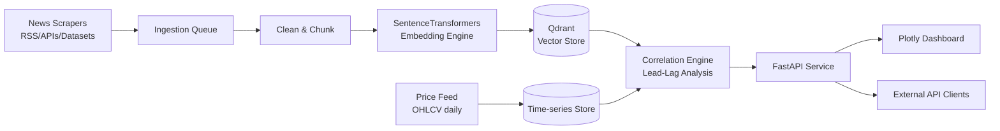

# Algorithmic Market Sentiment & News Vector Correlation Platform
### Product Requirements Document (PRD)

**Author:** Hardik Choudhary
**Status:** Draft v1.0
**Last updated:** September 24, 2026

---

## 1. Overview

The **Algorithmic Market Sentiment & News Vector Correlation Platform** is a data engineering and applied-ML system that continuously ingests financial news, converts each article into a dense semantic embedding, and statistically tests whether shifts in the news "sentiment vector space" **lead or lag** subsequent price movements in the underlying assets.

The output is a queryable API and an interactive dashboard that let a user pick a ticker or sector, see the news-vs-price correlation over time at a chosen lead-lag offset, and drill into the specific articles driving a signal.

This is built as a portfolio-grade capstone demonstrating the full stack of a modern GenAI-adjacent data platform: scraping, NLP/embeddings, vector databases, time-series correlation analysis, and a served API plus visualization layer.

---

## 2. Problem Statement

Market-moving information reaches traders through news long before it is fully priced in, but most retail and academic tools treat sentiment as a coarse positive/negative/neutral label attached to a single headline. That approach throws away:

- **Semantic nuance** — two articles with the same polarity label can differ enormously in what they actually mean for a specific asset.
- **Timing structure** — whether news tends to lead price (an early signal) or lag it (reporting on a move that already happened) is asset- and event-specific, and is rarely measured directly.
- **Traceability** — dashboards usually show a sentiment score with no way to trace it back to the specific articles or news cluster that produced it.

There is no lightweight, self-hostable platform that (a) represents news at the embedding level rather than a single scalar sentiment score, (b) explicitly computes a lead-lag correlation against price series rather than a same-day correlation, and (c) exposes both the signal and its evidentiary source articles through one API and dashboard.

---

## 3. Goals & Success Metrics

**Primary goals**

1. Continuously scrape and normalize financial news for a configurable universe of tickers/sectors.
2. Generate and store dense vector embeddings for every article, queryable by similarity and by time window.
3. Compute a statistically sound lead-lag correlation between the news-vector signal and price returns, at multiple lag offsets.
4. Serve results through a documented FastAPI layer and visualize them in an interactive Plotly dashboard.

| Metric | Target |
|---|---|
| News ingestion latency (publish → embedded & stored) | Under 5 minutes |
| Tickers/sectors covered at launch | 15–25 large-cap equities across 3–4 sectors |
| Embedding retrieval latency (top-k similarity query) | Under 300 ms at p95 |
| Lead-lag correlation window tested | −5 to +5 trading days |
| Backtest coverage | Minimum 2 years of historical news + price data |
| API uptime (demo/portfolio deployment) | 99% during evaluation period |
| Dashboard: time from ticker selection to rendered chart | Under 2 seconds |

---

## 4. Scope

**In scope (v1)**

- Scraping/ingesting news from a fixed set of financial news sources, RSS feeds, and archival datasets
- Text cleaning, deduplication, and chunking of articles
- Embedding generation via SentenceTransformers (`all-MiniLM-L6-v2`) for fast 384-d dense vector generation
- Vector storage and similarity search in Qdrant (local persistent collection)
- Daily-resolution price data ingestion for the covered tickers
- Lead-lag cross-correlation computation between the news-vector signal (e.g., mean embedding drift or sentiment-projected score) and price returns
- A FastAPI service exposing ingestion status, search, and correlation-query endpoints
- A Plotly-based dashboard for exploring correlation curves, article evidence, and per-ticker views

**Out of scope (v1)**

- Real-time/intraday (sub-minute) price or news ingestion
- Automated trading or order execution
- Coverage of asset classes beyond public equities (crypto, forex, commodities deferred)
- Multi-language news sources (English-only at launch)
- User authentication/multi-tenant accounts (single-operator deployment for the portfolio demo)

---

## 5. System Architecture

**Component breakdown**

- **News Scrapers** — scheduled jobs (e.g., Celery/cron) pulling from RSS feeds, news APIs, and archival datasets per ticker/sector
- **Ingestion Queue** — buffers raw articles for processing, decoupling scrape rate from embedding throughput
- **Clean & Chunk** — dedupe, strip boilerplate, split long articles into embeddable chunks
- **SentenceTransformers Embedding Engine** — generates 384-d dense vectors via `all-MiniLM-L6-v2`, with metadata tagging (ticker, timestamp, source), and upsert into the vector store
- **Qdrant** — stores embeddings with metadata filters for ticker, date range, and source
- **Time-series Store** — daily OHLCV price data (e.g., Postgres/TimescaleDB or a lightweight Parquet store)
- **Correlation Engine** — computes the news-vector signal per time bucket and cross-correlates it against price returns across a range of lag offsets
- **FastAPI Service** — REST endpoints for ingestion status, similarity search, and correlation queries; serves the dashboard's data
- **Plotly Dashboard** — interactive charts (correlation-vs-lag, price overlay, article evidence panel)

---

## 6. Functional Requirements

| ID | Requirement | Priority |
|---|---|---|
| FR-1 | System scrapes/ingests news for a configurable ticker/sector list on a scheduled interval | Must |
| FR-2 | System deduplicates near-identical articles (e.g., syndicated wire stories) before embedding | Must |
| FR-3 | System generates embeddings for each article/chunk and tags them with ticker, timestamp, and source metadata | Must |
| FR-4 | System upserts embeddings into Qdrant with filterable metadata | Must |
| FR-5 | System ingests daily OHLCV price data for all covered tickers | Must |
| FR-6 | System computes a lead-lag cross-correlation between the news-vector signal and price returns across a configurable lag window | Must |
| FR-7 | API exposes an endpoint to query correlation results by ticker and date range | Must |
| FR-8 | API exposes a similarity-search endpoint returning the articles behind a given signal spike | Must |
| FR-9 | Dashboard renders a correlation-vs-lag chart per selected ticker | Must |
| FR-10 | Dashboard lets a user click into a signal point and see the source articles | Should |
| FR-11 | System supports backfilling historical news + price data for backtesting | Should |
| FR-12 | System logs ingestion failures and exposes a health/status endpoint | Should |
| FR-13 | Dashboard supports comparing two tickers/sectors side by side | Could |

---

## 7. Data Pipeline

**Pipeline stages**

1. **Ingest** — scheduled scrape/pull jobs (or bulk-loaded historical datasets) write raw articles to a staging store with source + timestamp
2. **Clean** — strip HTML/boilerplate, dedupe near-duplicates, filter irrelevant articles by ticker/keyword match
3. **Chunk** — split long articles into embeddable passages (e.g., ~500-token chunks) while preserving article-level metadata
4. **Embed** — SentenceTransformers call to `all-MiniLM-L6-v2` embedding model; batch to control throughput
5. **Store** — upsert vectors into Qdrant with metadata filters (ticker, date, source, sentiment-adjacent tags)
6. **Aggregate** — roll up per-article embeddings into a per-day, per-ticker "news-vector" signal (e.g., centroid drift from a rolling baseline)
7. **Correlate** — cross-correlate the daily news-vector signal against next-day (and lagged) price returns, storing correlation coefficients per lag offset
8. **Serve** — FastAPI reads precomputed correlation results and supports on-demand similarity queries against the vector store

---

## 8. Real-World Datasets

To avoid relying purely on live scraping (which is slow to accumulate history and fragile to maintain), the platform should bootstrap and validate on the following existing public datasets. Live scraping can then extend the timeline forward from where these end.

### 8.1 Financial news datasets (for embeddings + historical backtesting)

| Dataset | What it contains | Source / link |
|---|---|---|
| **FNSPID** (Financial News & Stock Price Integration Dataset) | 15.7M time-aligned financial news articles + 29.7M stock prices for 4,775 S&P 500 companies, 1999–2023, with built-in sentiment scores | [github.com/Zdong104/FNSPID_Financial_News_Dataset](https://github.com/Zdong104/FNSPID_Financial_News_Dataset) (data hosted on Hugging Face) |
| **Financial PhraseBank / "Sentiment Analysis for Financial News"** | ~4,800 sentiment-labeled financial news headlines/sentences (positive/negative/neutral), annotated by finance professionals | Kaggle: [ankurzing/sentiment-analysis-for-financial-news](https://www.kaggle.com/datasets/ankurzing/sentiment-analysis-for-financial-news) |
| **Financial News Headlines (CNBC, Guardian, Reuters)** | Headlines + preview text scraped from CNBC, Guardian Business, and Reuters, Dec 2017 – Jul 2020 | Kaggle: [notlucasp/financial-news-headlines](https://www.kaggle.com/datasets/notlucasp/financial-news-headlines) |
| **Financial Sentiment Analysis dataset (sbhatti)** | Labeled financial statements/headlines for positive/negative/neutral sentiment classification | Kaggle: [sbhatti/financial-sentiment-analysis](https://www.kaggle.com/datasets/sbhatti/financial-sentiment-analysis) |
| **Sentiment Analysis — Labelled Financial News Data (Indian market)** | Financial news from The Economic Times, annotated by readers with a finance/stats background — useful given an India-based deployment | Kaggle: [aravsood7 dataset (Economic Times, labelled)](https://www.kaggle.com/datasets) — search "Sentiment Analysis Labelled Financial News Data" |

### 8.2 Price / market datasets (for the correlation target series)

| Dataset / API | What it contains | Source |
|---|---|---|
| **Yahoo Finance (via `yfinance`)** | Free daily/intraday OHLCV for global tickers, dividends, splits | [pypi.org/project/yfinance](https://pypi.org/project/yfinance/) |
| **Alpha Vantage** | Free-tier API for daily/intraday equity prices, plus a built-in News & Sentiment endpoint | [alphavantage.co](https://www.alphavantage.co/) |
| **NSE/BSE Bhavcopy (India)** | Official daily OHLCV bhavcopy files for NSE- and BSE-listed equities — relevant if the ticker universe includes Indian large-caps | [nseindia.com](https://www.nseindia.com/) |
| **FRED (Federal Reserve Economic Data)** | Macro indicators (rates, inflation, GDP) useful as control variables in the correlation model | [fred.stlouisfed.org](https://fred.stlouisfed.org/) |
| **SEC EDGAR** | 10-K/10-Q filings and earnings transcripts — optional secondary text source beyond news | [sec.gov/edgar](https://www.sec.gov/edgar) |

### 8.3 How to use them in the project

- **Bootstrap phase:** load FNSPID (or the smaller Kaggle sets, if FNSPID's scale is too large to embed on available compute) to populate the vector store with years of historical news and validate the correlation engine before wiring up live scrapers.
- **Price alignment:** join FNSPID's own price series or pull matching OHLCV from `yfinance`/Alpha Vantage for the same tickers and date range.
- **Live extension:** once backtesting on historical data validates the approach, point the scrapers at live RSS feeds for the same tickers to extend the timeline forward in real time.
- **India-specific angle:** pairing the Economic Times–labelled dataset with NSE Bhavcopy data lets the platform demo a India-market-specific correlation view alongside the S&P 500-based FNSPID backtest — a good differentiator for a portfolio project.

---

## 9. Non-Functional Requirements

| Category | Requirement |
|---|---|
| Performance | Embedding + correlation pipeline processes a day's news backlog for the full ticker universe in under 10 minutes |
| Scalability | Vector store and pipeline handle at least 50,000 articles without redesign; ticker universe expandable via config, not code changes |
| Reliability | Failed scrape/embed jobs retry with backoff; partial failures don't block unrelated tickers |
| Security | API keys/secrets stored outside source control (env vars/secret manager); no scraped content re-published beyond fair-use snippets |
| Observability | Structured logs for each pipeline stage; a `/health` endpoint reporting last successful ingestion time per source |
| Maintainability | Scraper, embedding, and correlation logic are separately testable modules; new news sources addable via a common adapter interface |
| Cost control | Embedding calls batched; correlation results cached/precomputed rather than recomputed per dashboard request |

---

## 10. Tech Stack Justification

| Component | Choice | Why |
|---|---|---|
| API layer | FastAPI | Async-native, auto-generated OpenAPI docs, low overhead — fits a data-heavy service with many read endpoints |
| Vector store | Qdrant (local persistent) | Self-hostable and free for portfolio deployment with strong metadata filtering and sub-300ms p95 retrieval |
| Embedding engine | SentenceTransformers (`all-MiniLM-L6-v2`) | Fast 384-d dense vector generation; runs locally with no API keys required |
| Visualization | Plotly | Interactive, zoomable time-series and correlation charts embeddable directly in a Python-served dashboard (Dash/Streamlit) without a separate frontend build |

This stack keeps the whole system inside the Python ecosystem, which shortens the path from data pipeline to API to dashboard and keeps the project buildable and demoable within a single repo.

---

## 11. Milestones & Roadmap

| Phase | Deliverable | Duration |
|---|---|---|
| 1. Foundations | Bulk-load historical datasets (FNSPID/Kaggle sets), price data ingestion, cleaning + dedupe pipeline | 2 weeks |
| 2. Embedding & Storage | SentenceTransformers embedding engine, Qdrant integration, metadata schema | 2 weeks |
| 3. Correlation Engine | Daily news-vector aggregation, lead-lag cross-correlation computation, backtest on 2+ years of historical data | 2 weeks |
| 4. Live Scrapers | RSS/API scrapers to extend the timeline forward from the historical datasets | 1 week |
| 5. API Layer | FastAPI endpoints for search, correlation query, and ingestion status; OpenAPI docs | 1 week |
| 6. Dashboard | Plotly dashboard — correlation-vs-lag view, article evidence drill-down, ticker selector | 1–2 weeks |
| 7. Polish & Write-up | Bug fixes, backfill validation, README + architecture write-up for the portfolio | 1 week |

---

## 12. Risks & Mitigations

| Risk | Mitigation |
|---|---|
| News source rate limits or licensing restrictions | Bootstrap on the historical datasets above; use free RSS feeds/APIs for live extension; avoid re-publishing full text |
| Spurious correlations from limited backtest window | Use at least 2 years of data (FNSPID covers 1999–2023), report confidence intervals, and flag low-sample-size correlations |
| Embedding drift as models change over time | Pin the embedding model version; re-embed the full corpus if the model is upgraded |
| Vector store cost/scale at growth | Start with self-hosted Qdrant local storage; migrate to Qdrant Cloud if scale demands it |
| Price data gaps (holidays, delistings) | Forward-fill or explicitly mark non-trading days before correlation computation |
| Scope creep toward a trading system | Explicit out-of-scope section above; no execution/order logic in v1 |

---

## 13. Open Questions

- Final ticker/sector universe: US large-caps (aligned with FNSPID), Indian large-caps (NSE), or a mix of both?
- Embedding model choice: open-source sentence-transformer (cheap, self-hosted) vs. an LLM-based embedding API (higher quality, recurring cost)?
- Deployment target for the demo: local/Docker Compose vs. a small cloud instance for the portfolio showcase?
