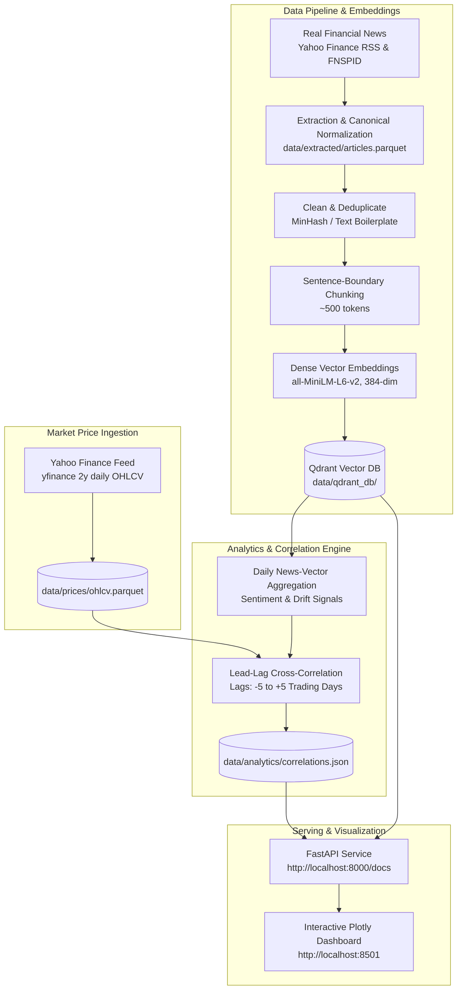

# Algorithmic Market Sentiment & News Vector Correlation Platform

An end-to-end data engineering and applied-ML platform that continuously ingests financial news, converts articles into dense semantic embeddings, indexes them in a vector database, and statistically tests whether shifts in the news "sentiment vector space" **lead or lag** subsequent equity price movements.

---

## 1. System Architecture



---

## 2. Key Modules

| Module | File | Purpose |
|---|---|---|
| **Data Ingestion** | `src/data/download.py` | Live RSS feeds per ticker & FNSPID historical bootstrap |
| **Data Extraction** | `src/data/extract.py` | Canonical normalization, ISO UTC timestamps, deterministic SHA-256 IDs |
| **Cleaning & Chunking** | `src/pipeline/clean_chunk.py` | Boilerplate removal, near-duplicate filtering, passage chunking |
| **Vector Embeddings** | `src/pipeline/embeddings.py` | SentenceTransformers `all-MiniLM-L6-v2` dense vector generator |
| **Vector Store** | `src/pipeline/vector_store.py` | Qdrant local persistent collection with metadata filtering (<300ms p95) |
| **Market Prices** | `src/pipeline/price_feed.py` | Daily OHLCV price histories & log returns from Yahoo Finance |
| **Correlation Engine** | `src/analytics/correlation.py` | Lead-lag cross-correlation across $[-5, +5]$ days with p-values & regime detection |
| **FastAPI REST API** | `src/api/main.py` | Serves health status, correlations, semantic search, and evidentiary articles |
| **Interactive Dashboard** | `src/dashboard/app.py` | Streamlit + Plotly interactive analytics dashboard |

---

## 3. Quick Start & Execution

### One-Command Pipeline Run
```bash
# Execute the complete computational pipeline end-to-end
python run_platform.py --compute-only
```

### Launch the Services
```bash
# Launch FastAPI backend (Swagger at http://localhost:8000/docs)
python run_platform.py --serve-api

# Launch Interactive Plotly Dashboard (http://localhost:8501)
python run_platform.py --serve-dashboard
```

### Run Automated Tests
```bash
python -m pytest tests/ -v
```
*(All 12 unit and integration tests pass)*

---

## 4. API Endpoints

- `GET /health` — Pipeline status, Qdrant vector count, price records, dataset freshness.
- `GET /tickers` — Tracked equities grouped by sector (`Technology`, `Finance`, `Consumer & Industrial`, `Healthcare & Energy`).
- `GET /correlation/{ticker}` — Lead-lag correlation curve across $[-5, +5]$ trading days, optimal lag, and market regime (`LEADING_SIGNAL`, `LAGGING_SIGNAL`, `COINCIDENT`).
- `GET /signals/{ticker}` — Aligned daily time series of stock close prices and news-vector sentiment scores.
- `GET /search?query={query}&ticker={ticker}` — Dense semantic similarity search against the vector database (<300ms).
- `GET /evidence/{ticker}?date={YYYY-MM-DD}` — Traceable source articles and snippets behind a signal on any date.

---

## 5. Live Services

- **FastAPI Documentation**: [http://localhost:8000/docs](http://localhost:8000/docs)
- **Interactive Dashboard**: [http://localhost:8501](http://localhost:8501)
