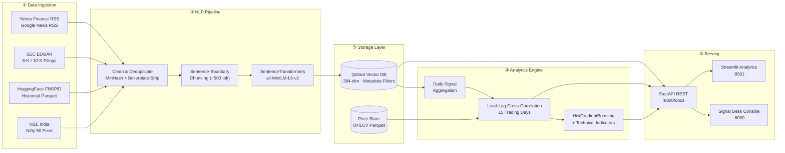

<div align="center">

<!-- ═══════════════════════════════════════════════════════ -->
<!--                       HERO SECTION                      -->
<!-- ═══════════════════════════════════════════════════════ -->


# Algorithmic Market Sentiment &<br/>News Vector Correlation Platform

**Decode the signal. Quantify the edge. Predict what moves markets.**

An end-to-end data engineering and applied-ML system that ingests live financial news,<br/>
converts articles into 384-dimensional semantic embeddings, indexes them in a vector database,<br/>
and statistically tests whether shifts in the news *sentiment vector space*<br/>
**lead or lag** subsequent equity price movements.

<br/>

[](https://python.org)
[](https://fastapi.tiangolo.com)
[](https://qdrant.tech)
[](https://sbert.net)
[]()
[](LICENSE)
[](Dockerfile)

---

<table>
<tr>
<td width="33%" align="center">
<h4>🎯 25+ Tickers</h4>
<sub>US Mega-Caps · Nifty 50 · Crypto · Commodities</sub>
</td>
<td width="33%" align="center">
<h4>⚡ &lt;300ms p95</h4>
<sub>Qdrant semantic search latency</sub>
</td>
<td width="33%" align="center">
<h4>📐 384-dim Vectors</h4>
<sub>Dense SentenceTransformer embeddings</sub>
</td>
</tr>
</table>

</div>

---

## 🏗️ System Architecture



---

## ✨ Feature Highlights

<table>
<tr>
<td width="50%">

### 🔍 Semantic News Search
Query the vector database with natural language. Returns the most semantically similar articles with cosine similarity scores — not just keyword matches.

</td>
<td width="50%">

### 📊 Lead-Lag Correlation
Statistically test whether news sentiment **leads** or **lags** price movements across a configurable ±5 day window, with p-values and regime classification.

</td>
</tr>
<tr>
<td width="50%">

### 🧠 ML Prediction Engine
HistGradientBoosting model fuses technical indicators (RSI, MACD, Bollinger) with sentiment signals for confidence-gated directional predictions.

</td>
<td width="50%">

### 🌐 Multi-Market Coverage
US mega-caps (NVDA, AAPL, TSLA), Indian equities (RELIANCE, TCS, INFY), crypto (BTC-USD), commodities (Gold), and major indices (S&P 500, Nasdaq 100).

</td>
</tr>
<tr>
<td width="50%">

### ⚡ Real-Time Ingestion Queue
Async streaming worker accepts live article pushes via API, embedding and indexing them into Qdrant in near real-time without pipeline restarts.

</td>
<td width="50%">

### 🛡️ Evidence Traceability
Every signal spike is traceable back to source articles. The `/evidence/{ticker}` endpoint returns the exact news snippets that drove a given day's sentiment.

</td>
</tr>
</table>

---

## 📂 Project Structure

```
Algorithmic-Market-Sentiment-News-Vector-Correlation-Platform/
│
├── src/
│   ├── config.py                    # Central configuration — paths, tickers, model params
│   ├── api/
│   │   ├── main.py                  # FastAPI application — REST endpoints + Signal Desk server
│   │   └── schemas.py               # Pydantic request/response models
│   ├── data/
│   │   ├── download.py              # Live RSS feed scraper (Yahoo Finance, Google News)
│   │   ├── edgar_feed.py            # SEC EDGAR 8-K/10-K filing ingestor
│   │   ├── fnspid_hf_feed.py        # HuggingFace FNSPID historical dataset loader
│   │   ├── nse_feed.py              # NSE India equity news feed
│   │   ├── extract.py               # Canonical normalization & SHA-256 dedup
│   │   ├── database.py              # SQLite connection manager
│   │   ├── vector_handoff.py        # Qdrant ↔ analytics bridge
│   │   ├── schemas.py               # Data layer Pydantic models
│   │   └── validators.py            # Input validation utilities
│   ├── pipeline/
│   │   ├── clean_chunk.py           # HTML stripping, boilerplate removal, passage chunking
│   │   ├── embeddings.py            # SentenceTransformers embedding engine
│   │   ├── vector_store.py          # Qdrant persistent collection manager
│   │   ├── price_feed.py            # Yahoo Finance OHLCV downloader + log returns
│   │   └── realtime_queue.py        # Async real-time article ingestion worker
│   ├── analytics/
│   │   ├── correlation.py           # Lead-lag cross-correlation + backtest engine
│   │   └── high_accuracy_model.py   # HistGradientBoosting ML predictor
│   ├── dashboard/
│   │   └── app.py                   # Streamlit interactive analytics dashboard
│   └── utils/
│       └── logger.py                # Structured logging configuration
│
├── web/                             # Signal Desk — static HTML/JS/CSS command console
│   ├── index.html
│   ├── app.js
│   └── style.css
│
├── tests/
│   ├── test_extraction.py           # Data pipeline unit tests
│   └── test_full_platform.py        # End-to-end integration tests
│
├── data/                            # Runtime data (gitignored, structure preserved)
│   ├── raw/                         # RSS XML feeds & historical downloads
│   ├── extracted/                   # Canonical articles (Parquet)
│   ├── processed/                   # Chunked passages (Parquet)
│   ├── prices/                      # OHLCV price data (Parquet)
│   ├── analytics/                   # Correlation results (JSON)
│   ├── data_store/                  # SQLite database
│   └── qdrant_db/                   # Vector database storage
│
├── run_platform.py                  # 🚀 Main orchestrator — pipeline + services
├── run_extraction.py                # Standalone extraction pipeline runner
├── ingest_massive_data.py           # Multi-phase bulk data ingestion script
├── requirements.txt                 # Python dependencies
├── Dockerfile                       # Container build
├── docker-compose.yml               # Multi-service orchestration
├── .env.example                     # Environment variable template
└── LICENSE                          # MIT License
```

---

## 🚀 Quick Start

### Prerequisites

- **Python 3.11+**
- **pip** (or **uv** for faster installs)

### 1. Clone & Install

```bash
git clone https://github.com/Har-dik25/Algorithmic-Market-Sentiment-News-Vector-Correlation-Platform.git
cd Algorithmic-Market-Sentiment-News-Vector-Correlation-Platform

# Install dependencies
pip install -r requirements.txt
```

### 2. Run the Full Pipeline

```bash
# Execute the complete computational pipeline end-to-end:
#   Ingest → Clean → Embed → Store → Fetch Prices → Correlate
python run_platform.py --compute-only
```

### 3. Launch Services

```bash
# Option A: API only (Swagger UI at http://localhost:8000/docs)
python run_platform.py --serve-api

# Option B: Interactive dashboard only (http://localhost:8501)
python run_platform.py --serve-dashboard

# Option C: Everything — API + Dashboard concurrently
python run_platform.py --serve-api --serve-dashboard
```

### 4. Docker (Alternative)

```bash
docker-compose up --build
```

---

## 🔌 API Reference

All endpoints are auto-documented at [`http://localhost:8000/docs`](http://localhost:8000/docs) via Swagger UI.

| Method | Endpoint | Description |
|:---:|---|---|
| `GET` | `/health` | System health — Qdrant vector count, price records, pipeline freshness, uptime |
| `GET` | `/tickers` | Full ticker universe grouped by sector |
| `GET` | `/correlation/{ticker}` | Lead-lag correlation curve across ±5 trading days, optimal lag offset, market regime classification (`LEADING_SIGNAL` · `LAGGING_SIGNAL` · `COINCIDENT`) |
| `GET` | `/signals/{ticker}` | Aligned daily time series — stock close price × news-vector sentiment score |
| `GET` | `/search?query=...&ticker=...` | Dense semantic similarity search against Qdrant (<300ms p95) |
| `GET` | `/evidence/{ticker}?date=YYYY-MM-DD` | Source articles and text snippets behind a specific signal date |
| `POST` | `/ingest` | Push a live article into the real-time ingestion queue |
| `POST` | `/recompute?api_key=...` | Trigger a full pipeline recomputation (protected) |

---

## 🧪 Testing

```bash
# Run full test suite (13 tests — unit + integration)
python -m pytest tests/ -v
```

| Test | Scope | Validates |
|---|---|---|
| `test_rss_extractor` | Unit | RSS XML parsing → CanonicalArticle mapping |
| `test_edgar_extractor` | Unit | SEC EDGAR filing extraction pipeline |
| `test_fnspid_extractor` | Unit | HuggingFace Parquet dataset loading |
| `test_parquet_save_and_validation` | Integration | End-to-end Parquet serialization + schema validation |
| `test_clean_text_strips_html` | Unit | HTML boilerplate removal accuracy |
| `test_chunking_respects_boundaries` | Unit | Sentence-boundary splitting correctness |
| `test_deduplication` | Unit | Near-duplicate filtering via MinHash |
| `test_embedding_engine` | Integration | SentenceTransformers vector shape and cosine similarity |
| `test_qdrant_vector_store_roundtrip` | Integration | Embed → upsert → query roundtrip through Qdrant |
| `test_correlation_engine_math` | Unit | Cross-correlation computation and p-value math |
| `test_fastapi_endpoints` | Integration | All REST endpoints return correct status codes + schemas |
| `test_high_accuracy_predictor_gating` | Integration | ML model confidence gating and prediction pipeline |
| `test_extraction_pipeline` | Integration | Full 4-source extraction pipeline validation |

---

## 🛠️ Tech Stack

| Layer | Technology | Role |
|---|---|---|
| **API** | FastAPI + Uvicorn | Async REST service with auto-generated OpenAPI docs |
| **Embeddings** | SentenceTransformers (`all-MiniLM-L6-v2`) | 384-dim dense vector generation — runs locally, no API keys |
| **Vector DB** | Qdrant (local persistent) | Sub-300ms semantic search with metadata filtering |
| **ML** | scikit-learn (HistGradientBoosting) | Confidence-gated directional prediction |
| **Analytics** | NumPy · SciPy · pandas | Cross-correlation, statistical testing, time-series alignment |
| **Visualization** | Plotly · Streamlit | Interactive correlation curves and signal dashboards |
| **Frontend** | Signal Desk (vanilla HTML/JS/CSS) | Glassmorphic dark-mode command console |
| **Data** | Apache Parquet · SQLite | Columnar storage for articles/prices, relational for metadata |
| **Infra** | Docker · GitHub Actions | Containerized deployment and CI pipeline |

---

## 📈 How It Works

```
                    ┌─────────────────────────────────────────────┐
   Day 0            │  "NVIDIA announces record AI chip orders"   │
   ──────────────── │  "Tesla Cybertruck deliveries surge 40%"    │
                    │  "Fed signals rate pause — markets rally"   │
                    └──────────────┬──────────────────────────────┘
                                   │
                                   ▼
                    ┌──────────────────────────────┐
                    │   embed() → 384-dim vector    │
                    │   per chunk, per article       │
                    └──────────────┬───────────────┘
                                   │
                                   ▼
                    ┌──────────────────────────────┐
                    │   Aggregate daily centroid     │
                    │   drift from rolling baseline  │
                    │   = "News Vector Signal"       │
                    └──────────────┬───────────────┘
                                   │
            ┌──────────────────────┼──────────────────────┐
            ▼                      ▼                      ▼
     ┌─────────────┐     ┌─────────────┐      ┌──────────────────┐
     │  Lag = -2    │     │  Lag = 0    │      │   Lag = +3       │
     │  corr: 0.12  │     │  corr: 0.31 │      │   corr: 0.47 ★  │
     │  p: 0.34     │     │  p: 0.08    │      │   p: 0.003       │
     └─────────────┘     └─────────────┘      └──────────────────┘
                                                       │
                                                       ▼
                                              LEADING_SIGNAL
                                        "News led price by 3 days"
```

---

## 🤝 Contributing

Contributions are welcome! Please follow these steps:

1. **Fork** the repository
2. **Create** a feature branch (`git checkout -b feature/amazing-feature`)
3. **Commit** your changes (`git commit -m 'Add amazing feature'`)
4. **Push** to the branch (`git push origin feature/amazing-feature`)
5. **Open** a Pull Request

---

## 📄 License

This project is licensed under the **MIT License** — see the [LICENSE](LICENSE) file for details.

---

<div align="center">
<br/>

**Built with ◆ by [Har-dik25](https://github.com/Har-dik25)**

<sub>If this project helped you, consider giving it a ⭐</sub>

</div>
